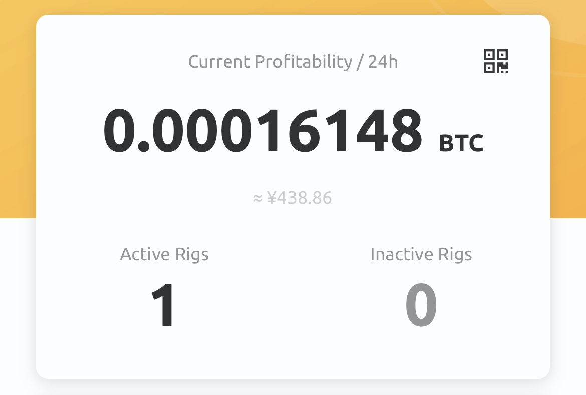

仮想通貨のマイニングをはじめた。

## 結論
今の所、儲かりそう。

<!--more-->

### １日あたり

**掘れ高**:438円/d  
**電気代**:0.23[kW] * 25 [円*KW/h] * 24 = 138[円/d]

438 - 138 = 300[円/d]

### 1月あたり
9000[円/m]!!!

## パソコンのスペック
* CPU: intell 10400F
* GPU: Palit GeForce RTX™ 3070 JetStream OC
  * https://www.palit.com/palit/vgapro.php?id=3851&lang=jp
  
## 詳細
CPU miningは赤字だからやってない。
GPUだけ。

[NiceHash](https://www.nicehash.com)使った。  
始めるのは簡単だった。  

チューニングはやったほうが良い。  
これで、ワットパフォーマンスが1.4倍くらいになった。
しかも、発熱が抑えられ、GPUにヘルシーになった。

NiceHashがsweet spotを教えてくれてる。  
https://www.nicehash.com/blog/post/nvidia-geforce-rtx-3070-mining-hashrate

これで、消費電力が200W -> 160Wになり、ハッシュレートも53MH/sくらから、60MH/sに上がった。

グラボのOCには [msi AfterBurner](https://jp.msi.com/Landing/afterburner) を使った。  
グラボもマザボもmsiじゃないけど、普通に使えた。（次はmsi買いますね。）  

OCって、GPUを消耗する行為だと思ったけど、逆に制限加えてヘルシーにできるってことを知った。

ついでに、マイニングちゃんとしたやり方すればGPUにダメージないよ。っていう記事  
https://www.nicehash.com/blog/post/can-mining-damage-my-gpu-or-a-pc

以上
