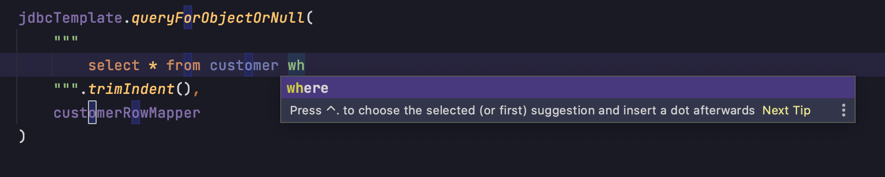
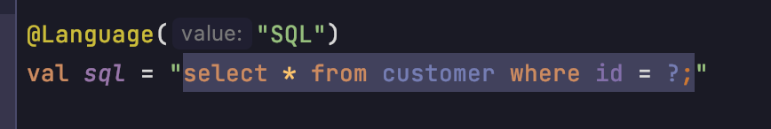
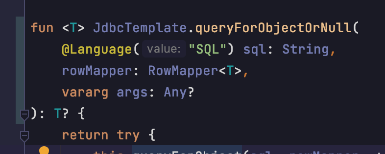

## 背景

jdbcTemplateの引数のSQLって、intellijで補完効きますよね。

でも、下記のように、SQLだと認識できない文字列だと、補完は効きません。

今回は、これをIntellijにSQLだと認識させられるようにします！

## 前提
以下を依存関係に追加  
https://mvnrepository.com/artifact/com.intellij/annotations

なくても、いけるかもしれない。

## SQLだと認識させる方法

`org.intellij.lang.annotations.Language`アノテーションを適当な場所につけて、
valueに"SQL"をいれる。

以下のように、引数にもつけられるので、JdbcTemplateを拡張したら、ハイライトつかなくなった！みたいな場合も安心。

