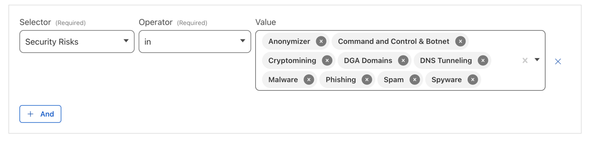

## 背景

開発環境の口を狭くするために、リモート環境のクライアントPCのGlobalIPを固定したかった。
IPの固定だけに、Cloudflare Zero Trustを使うのはオーバスペック感はあるけど、50名まで無料で使え、ついでに、マルウェアの対策になるらしいので、
使ってみることにした。

## 構成

private subnetにして、NAT GatewayにEIPを割り当てるほうが、セキュリティ的には良いですが、
NAT Gateway分のお金を節約するために、直、エージェント用のサーバからインターネットに出るようにしました。

将来、この環境を別のVPCとPeeringして、みたいな構成にする時にやればいいと思うので、とりあえずは、これで。

## やることの流れ

1. Cloudflareのアカウントを作る
2. Zero TrustのTeam domainを定義する
3. Planで、Free Planを選ぶ（これをしないとtunnelが設定できない）
4. Zero Trust -> Settings -> Firewall -> Proxyを有効にする
5. Access -> Tunnels -> Create Tunnel
   6. Routesは0.0.0.0/0にして、全てのトラフィックをトンネルに流す
7. AWSで上記構成を参考に環境を作る
8. EC2インスタンスを立てる(ubuntu,T2,microでOK)
9. CloudflareのTunnelにあるコマンドをコピーして、EC2インスタンスで実行。トンネルが繋がる
   10. 同じことをもう１台やれば、冗長化できる
10. クライアントPCにWRAPをインストールする
11. WRAPを起動して、設定する。

## 感想

### 接続中も回線速度が速い

インターネット回線速度テストの結果が、むしろ接続した方が良い結果になる

### 接続のON, OFFがめちゃ楽

トグルをオンオフするだけ

### 安い

かかるのはAWSの料金だけ

### 設定には慣れが必要

２、３日向き合うと、理解できるけど、できることが多く、最初はよくわからなかった。

## その他、TIPS

### マルウェア対策について

マルウェア対策は、Firewall policiesで設定する。色々監視してくれて良いが、HTTPSの通信を監視してもらうには、
設定を有効にした上で、クライアントにCloudflareのCA証明書をインストールしないといけない。
仕方ないけど、ちょっと全利用者にお願いしてっていうのもあれなので、今回はあきらめた。

## 総評

最初、学習コストは高いけど、Cloudflareはとても良いプロダクト。
まずは、IPを固定する用途で入れで、徐々に会社のフェーズに合わせて、セキュリティを強化していく感じの使い方ができそう。
